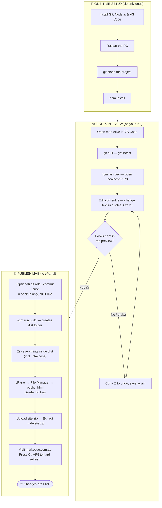

# 📘 Marketive — Content Editing Guide (For Non‑Technical Users)

This guide explains **everything from scratch** — how to install the tools, get the
project onto your computer, change the website text, preview it, **build it, and upload it
to cPanel so it goes live**. No prior coding knowledge needed. Just follow the steps in order.

> **The only file you ever need to edit is:**
> `src/content/content.js`
> All website text lives inside this one file. Nothing else needs to be touched.

> ⚠️ **IMPORTANT — how the site goes live:**
> Saving to GitHub (`git push`) does **NOT** update the live website. To publish your
> changes you must **build the site** (`npm run build`) and **upload the build to cPanel**.
> This is explained step‑by‑step in **Part 4**.

---

## 🧩 Part 0 — What you are about to do (the big picture)

1. **Install 3 free programs** (one time only): Git, Node.js, VS Code.
2. **Download the project** from GitHub to your computer (one time only).
3. **Change the text** in `content.js` and preview it live with `npm run dev`.
4. **Build the site** with `npm run build` (creates a `dist` folder).
5. **Upload the `dist` folder to cPanel** — this is what actually makes it live.

Steps 1 and 2 are done **only once**. After that, your routine is steps 3–5.

```
EDIT text  →  PREVIEW (npm run dev)  →  BUILD (npm run build)  →  UPLOAD dist to cPanel  →  LIVE
```

---

## 📦 Downloads at a glance (where to get everything)

You install **three** free programs yourself. Everything else the project needs is
downloaded **automatically** later by one command (`npm install`).

| Program | What it's for | Where to download | Notes |
|---------|---------------|-------------------|-------|
| **Git** | Downloads the project and saves your changes | **https://git-scm.com/download/win** | Free · click Next through the installer |
| **Node.js** | Runs the website + installs libraries + builds it | **https://nodejs.org** | Free · click the **"LTS"** button |
| **VS Code** | Where you edit text and run commands | **https://code.visualstudio.com** | Free · tick **"Add to PATH"** |

---

## 🛠️ Part 1 — Install the tools (ONE TIME ONLY)

### 1.1 Install Git
Go to **https://git-scm.com/download/win** → the download starts automatically → open it →
click **Next** on every screen → **Install** → **Finish**.

### 1.2 Install Node.js
Go to **https://nodejs.org** → click the big **"LTS"** button → open the file →
**Next / Install / Finish**.

### 1.3 Install VS Code
Go to **https://code.visualstudio.com** → **Download for Windows** → open the file → keep
**"Add to PATH"** ticked → **Install / Finish**.

### 1.4 Restart your computer
After installing all three, **restart your PC once** so everything works together.

---

## 📥 Part 2 — Get the project onto your PC (ONE TIME ONLY)

> The **terminal** is the dark box at the bottom of VS Code. Open it with **View → Terminal**.

1. Open **VS Code** → **View → Terminal**.
2. Go to your Desktop:
   ```bash
   cd Desktop
   ```
3. Download the project:
   ```bash
   git clone https://github.com/SIDDH5320/marketive.git
   ```
   The first time, a window may ask you to **sign in to GitHub** in your browser. Sign in
   with the account you were given. This happens only once.
4. Open the project: **File → Open Folder** → choose the **marketive** folder → **Select Folder**.
5. Install the building blocks (**one time only**):
   ```bash
   npm install
   ```
   Wait until the text stops and your cursor comes back.

> 🎉 Setup is complete. From now on you only repeat **Part 3** and **Part 4**.

---

## ℹ️ What runs this project (installed automatically)

You do **not** install these one by one. The single `npm install` command above downloads
every library below. This list is just so you know what's under the hood.

**System requirements:** Windows 10 or 11 · about 500 MB free space · an internet connection.

| Library | What it does |
|---------|--------------|
| **React** & **React DOM** | The framework the whole website is built on |
| **Vite** | Runs the live preview and **builds** the final site |
| **Tailwind CSS** | Handles all the styling and design |
| **React Router** | Moves between pages (Home, Services, About…) |
| **Framer Motion** | The animations and smooth transitions |
| **Lucide React** | The icons used across the site |
| **Lenis** | The smooth‑scrolling effect |
| **React Helmet Async** | Page titles and SEO tags |
| **Zod** | Checks that data is valid |

> **In short:** you install Git + Node.js + VS Code yourself. Everything above is installed
> for you by `npm install`.

---

## ✏️ Part 3 — Edit & preview your changes (do this every time)

### Step 1 — Open the project
Open **VS Code** → **File → Open Folder** → choose the **marketive** folder.

### Step 2 — Get the latest version
In the terminal:
```bash
git pull
```

### Step 3 — Start the live preview
```bash
npm run dev
```
Hold **Ctrl** and click the `http://localhost:5173/` link that appears (or paste it into
your browser). **Leave this running** while you work.

### Step 4 — Open the content file
In the left sidebar: **`src`** → **`content`** → click **`content.js`**.

### Step 5 — Change the text and save
Type your new text **between the quotation marks**, then press **Ctrl + S**. The preview in
your browser updates automatically — no refresh needed.

```js
// BEFORE
headline: "We Build Brands That",

// AFTER (only the words inside the quotes changed)
headline: "We Grow Businesses That",
```

### Step 6 — Check your changes
Look at the browser preview. Your new text should appear. Click around to make sure
everything still looks right.

> ✅ This preview is only on **your** computer. The public website has **not** changed yet.
> To publish it, continue to **Part 4**.

---

## 🚀 Part 4 — Publish your changes LIVE (upload to cPanel)

> **This is the part that actually updates the real website at marketive.com.au.**
> `npm run dev` is only a preview on your PC. `git push` only backs up the code.
> **The website only changes when you build and upload the `dist` folder to cPanel.**

### Step 1 — (Optional) Back up your code to GitHub
This saves a history of your edits. It does **not** make the site live, but it's good
practice. Run these three, one at a time:
```bash
git add .
```
```bash
git commit -m "Updated homepage headline text"
```
```bash
git push
```

### Step 2 — Build the website
This packages the site into a folder called **`dist`**:
```bash
npm run build
```
When it finishes, you'll see a new **`dist`** folder in the project (in the left sidebar).
**This `dist` folder is the actual website** that gets uploaded.

### Step 3 — Prepare the files to upload
1. **One‑time setting:** in Windows File Explorer, click **View → Show → Hidden items**.
   (This makes a file called **`.htaccess`** visible — it's required for the pages to work.)
2. Open the **`dist`** folder inside your project.
3. Select **everything inside** it: press **Ctrl + A**. You should see `index.html`, an
   `assets` folder, and a `.htaccess` file among the selected items.
4. Right‑click → **Send to → Compressed (zipped) folder**. Rename the new file **`site.zip`**.

### Step 4 — Upload to cPanel
1. Open your browser and **log in to cPanel** (your hosting login).
2. Open **File Manager**.
3. Go into the **`public_html`** folder.
4. **(Recommended)** Select the **old website files inside** `public_html` and **delete** them,
   so nothing stale is left behind. *(Do not delete the `public_html` folder itself.)*
5. Click **Upload** (top toolbar) → choose your **`site.zip`** → wait for **100%**.
6. Go back to **`public_html`**, right‑click **`site.zip`** → **Extract** → extract into `public_html`.
7. Delete **`site.zip`** afterwards.
8. Confirm that `index.html`, the `assets` folder, and **`.htaccess`** now sit **directly
   inside** `public_html`. *(In cPanel: **Settings → Show Hidden Files** if you don't see
   `.htaccess`.)*

### Step 5 — Check the live website
1. Visit **https://marketive.com.au**.
2. Press **Ctrl + F5** (a "hard refresh") so your browser loads the new version, not an old
   cached one.
3. Click through the pages (Home, Services, About…) to confirm everything works.

> 🎉 Your changes are now **live** for everyone. ✅

---

## 🚦 Part 5 — The Golden Rules of editing `content.js`

| ✅ DO | ❌ DON'T |
|------|---------|
| Change text **inside** the `"quotation marks"` | Delete or remove the quotation marks |
| Keep the comma `,` at the end of each line | Delete commas, colons `:`, brackets `[ ]` or `{ }` |
| Change one thing, save, and check the preview | Change many things at once without checking |
| Keep the word before the colon (like `headline:`) exactly as it is | Rename the words before the colon |

**Rule of thumb:** if it's **inside quotes**, you can change it. If it's **outside quotes**
(colons, commas, brackets, labels), leave it alone.

---

## 🆘 Part 6 — Troubleshooting

**The preview shows a blank white screen or an error.**
→ You probably deleted a quote or a comma. Press **Ctrl + Z** several times to undo, then
save again (**Ctrl + S**).

**The `http://localhost:5173` preview won't open.**
→ Make sure `npm run dev` is still running in the terminal. If you closed it, run
`npm run dev` again.

**I uploaded to cPanel but the live site looks the same.**
→ Your browser is showing a cached copy. Press **Ctrl + F5** to hard‑refresh. Also double‑check
you uploaded the files from the **`dist`** folder into **`public_html`**.

**The Home page works, but clicking or refreshing another page (e.g. /services) shows a
"404 Not Found" error on the live site.**
→ The **`.htaccess`** file didn't make it into `public_html`. Re‑do **Part 4, Step 3–4** and
make sure hidden files are shown so `.htaccess` is uploaded. It must sit directly in
`public_html`.

**The live site loads but looks broken (no styling/images).**
→ The files were probably extracted into a sub‑folder (like `public_html/dist`) instead of
directly into `public_html`. Move them up so `index.html` is directly inside `public_html`.

**I want to stop the preview.**
→ Click inside the terminal and press **Ctrl + C**. To start it again, type `npm run dev`.

---

## 📋 Quick Reference (cheat sheet)

| I want to... | Type this in the terminal |
|--------------|---------------------------|
| Get the latest version | `git pull` |
| Start the live preview | `npm run dev` |
| Stop the live preview | `Ctrl + C` |
| (Optional) Back up code to GitHub | `git add .` → `git commit -m "note"` → `git push` |
| **Build the site for upload** | `npm run build` |
| **Publish it live** | Upload the **`dist`** folder to **`public_html`** in cPanel |

> **One-time only:** installing Git / Node.js / VS Code, `git clone`, and `npm install`.
> **Everyday:** `git pull` → `npm run dev` → edit `content.js` → **`npm run build`** →
> **upload `dist` to cPanel** → hard‑refresh the live site.

---

## 🗺️ Visual Flowchart



---

*Made for the Marketive website. Remember: editing and previewing happen on your PC;
the site only goes live after `npm run build` + uploading the `dist` folder to cPanel.*
